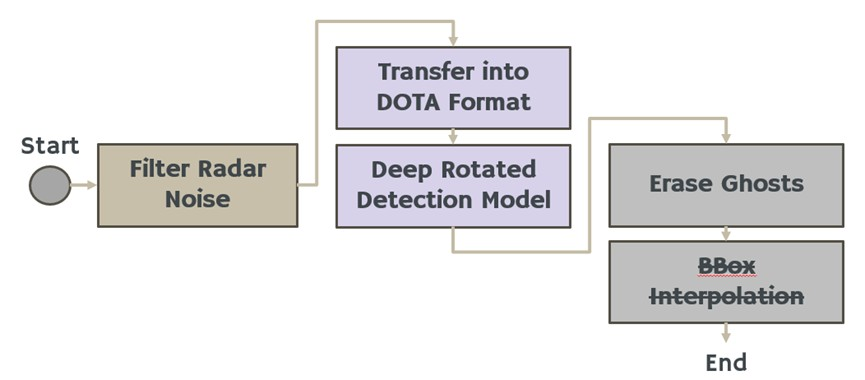
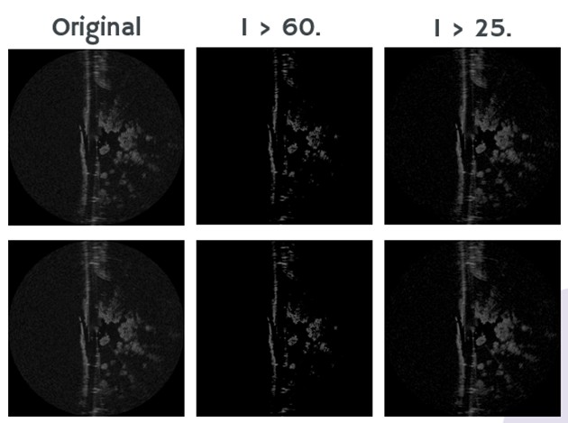
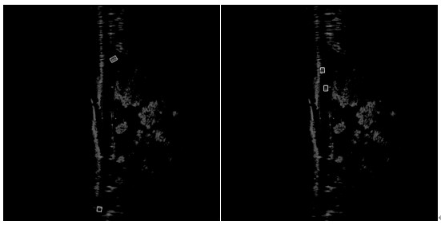
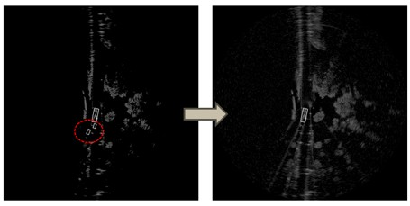

# SDC-Radar-Detection

## Flow

<div align=center>

</div>

The [radar object detection competetion](https://hackmd.io/@o9u3GdlgQHek0bP3DEeBIA/B1f89FlmT) of NYCU 2024 SDC

## Installation

We use [MMRotate](https://github.com/open-mmlab/mmrotate) as our detection frameworkm, which requires Python 3.7+, CUDA 9.2+ and PyTorch 1.6+.

```bash
git clone https://github.com/jimmylin0979/SDC-Radar-Detection.git
cd SDC-Radar-Detection

# pytorch
# please install following https://pytorch.org/get-started/previous-versions/
conda install pytorch==1.12.1 torchvision==0.13.1 torchaudio==0.12.1 cudatoolkit=11.3 -c pytorch

# mmrotate
# please install mmrotate following https://mmrotate.readthedocs.io/en/latest/install.html#installation
cd mmroate 
pip install -U openmim
mim install mmcv-full
mim install mmdet\<3.0.0
pip install -v -e .

# install other dependencies
cd ..
pip install -r requirements.txt
```

## PreProcess

<div align=center>

</div>

Download [SDC dataset zip file](https://drive.google.com/drive/folders/1t8mpGl98o3kfc4nDWA7MC_ahNk8Kl_SG), unzip and place them under `data` folder with below format:
```bash
# Dataset structure 
data
├── Competition_Image
├── mini_test
├── mini_train
├── whole_train
├── test2dota.py
├── train2dota.py
├── ...
```

```bash
# cd into data folder
cd data

# the following command will generate 'mini_train_dota' folder for transfered dataset
python3 train2dota.py   # transfer mini_train to DOTA format
python3 test2dota.py    # transfer mini_test to DOTA format
python3 preprocess.py   # filter out too small radar value 

# the following command will generate 'Competetion_Image_preprocessed'
python3 preprocess_Competition.py   # filter out too small radar value for competition image
```

## Training

In this competetion, I use [ReDet](https://github.com/open-mmlab/mmrotate/tree/main/configs/redet) as our detection model, to reproduce, please download pretrained weight of ReResNet backbone from [ReDet](https://github.com/csuhan/ReDet), and put it on `mmrotate/work_dirs/pretrain`.

```bash
# cd in mmrotate folder
cd mmrotate

# the training command in mmrotate
# train model declared in CONFIG_FILE, and store everything in WORK_DIR
CONFIG_FILE=configs/sdc/???.yaml
WORK_DIR=../results/???
python tools/train.py ${CONFIG_FILE} --work-dir ${WORK_DIR}
```

```bash
# Example
# train with redet with config redet_re50_refpn_1x_dota_ms_rr_le90, and store the checkpoint into work dir
python3 tools/train.py configs/sdc/redet_re50_refpn_1x_dota_ms_rr_le90.py --work-dir ../results/redet_re50_refpn_1x_dota_ms_rr_le90
```

## Inference

<div align=center>

</div>

```bash
# inference the rotated object detection model with specific config files, checkpoint path and image root
# it will generate a viz folder for visualization and a json file for predictions
CONFIG_FILE=../results/???/???.yaml
CKPT_DIR=../results/???
IMG_DIR=???
python inference.py --config ${CONFIG_FILE} --ckpt ${CKPT_DIR} --root ${IMG_DIR}
```

```bash
# Example
# inference the redet with config, and checkpoint on images under `./data/Competetion_Image_preprocessed` folder
python inference.py --config results/redet_re50_refpn_1x_dota_ms_rr_le90/redet_re50_refpn_1x_dota_ms_rr_le90.py --ckpt results/redet_re50_refpn_1x_dota_ms_rr_le90/latest.pth --root ./data/Competetion_Image_preprocessed
```

## PostProcess

<div align=center>

</div>

```bash
# postprocess with eraseGhost function to improve model's FP
JSON_PATH=???
SAVE_PATH=???
IMG_DIR=???
pytho postprocess.py --json-path ${JSON_PATH} --save-path ${SAVE_PATH} --root-image ${IMG_DIR}
```

```bash
# Example 
# postprocess with prediction files (.json) and save new one as predictions.json, with provided root image dir for visualization 
python postprocess.py --json-path ./results/redet_re50_refpn_1x_dota_ms_rr_le90/rotated_redet_re50_refpn_1x_dota_ms_rr_le90.json --save-path predictions.json --root-image ./data/Competition_Image_preprocessed
```

## Reference

+ [Radiate SDK](https://github.com/marcelsheeny/radiate_sdk)
+ [MMRotate](https://github.com/open-mmlab/mmrotate)